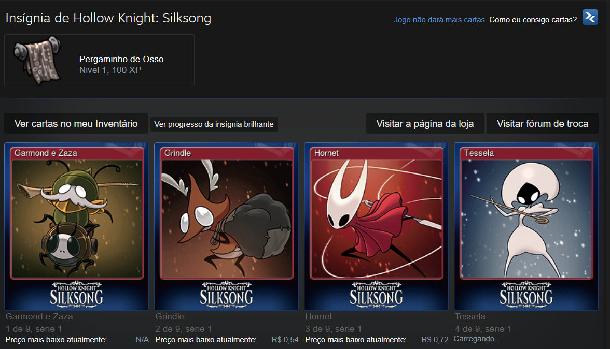
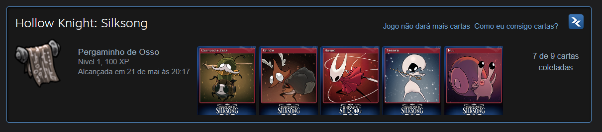
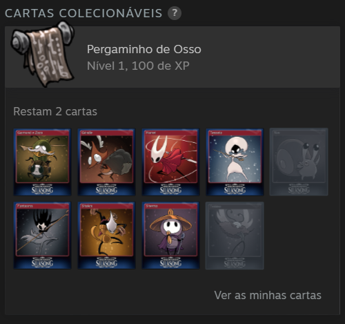

# Lua Games Card Bridge

plugin that locally bridges Lua games into Steam's native badge and Trading Cards UI paths.

The goal is to make Lua game card pages feel consistent with normal Steam games while staying local.

## Features

- Reads local Lua game entries from `Steam/config/stplug-in/*.lua`.
- Checks public Steam Store metadata for the "Steam Trading Cards" category.
- Captures SteamUI webpack modules and patches local badge/card data loading.
- Adds the native Library cards section when SteamUI skipped it for a local Lua game.
- Applies local visual card progress in the Library card section: one visual card every 30 minutes of SteamUI playtime.
- Adds a Millennium configuration option for the visual drop cap: Steam-like half set, or the full set.
- Adds local visual badge crafting on Steam Community gamecards pages.
- Shows local badge progress on the Steam Community badges page.

## Screenshots

### Steam Community Gamecards

### Steam Community Badges

### Steam Library Cards Section

